# Cross-Namespace Authentication with Kong API Gateway (2026 Standards)

This diagram demonstrates authentication patterns using Kong API Gateways for centralized auth.

## Key Differences from Standard Flow

1. **Direct JWT Response**: External IAM returns JWT tokens directly (no auth code exchange)
2. **Centralized Auth**: Kong Gateways handle all JWT validation via plugins
3. **Gateway-to-Gateway Trust**: Cross-namespace calls use service tokens between Kong instances
4. **Rich Plugin Ecosystem**: Rate limiting, correlation IDs, request transformation at the edge

## Sequence Diagram

```mermaid
sequenceDiagram
    autonumber
    box rgb(230, 245, 255) Namespace A
        participant Customer as 👤 Customer Browser
        participant WebApp as 🌐 Web Application
        participant KongA as 🦍 Kong Gateway A
        participant AgentA as 🤖 Agent Service A
        participant ServiceA2 as ⚙️ Internal Service A2
    end
    
    box rgb(255, 240, 230) External IAM
        participant ExtIAM as 🔐 External IAM<br/>(Direct JWT)
    end
    
    box rgb(240, 255, 240) Namespace B
        participant KongB as 🦍 Kong Gateway B
        participant AgentB as 🤖 Agent Service B
    end
    
    box rgb(255, 245, 230) Internal IAM
        participant IntIAM as 🔑 Internal IAM<br/>(Service Auth)
    end

    Note over Customer, IntIAM: Phase 1: Customer Authentication (Direct JWT - No Auth Code)
    
    Customer->>WebApp: 1. Login request
    WebApp->>ExtIAM: 2. Token request (username/password)
    ExtIAM->>ExtIAM: 3. Validate credentials
    ExtIAM-->>WebApp: 4. JWT tokens directly<br/>(access + ID + refresh)
    Note over ExtIAM: No auth code exchange!<br/>Tokens returned immediately
    WebApp-->>Customer: 5. Session established

    Note over Customer, IntIAM: Phase 2: Request Through Kong Gateway B

    Customer->>WebApp: 6. Trigger chatbot action
    WebApp->>KongB: 7. API request with Bearer token
    
    rect rgb(255, 250, 230)
        Note over KongB: Kong Plugins Execute
        KongB->>KongB: 8. Correlation ID Plugin<br/>Generate X-Correlation-ID
        KongB->>KongB: 9. JWT Plugin<br/>Validate token, check scopes
        KongB->>KongB: 10. Rate Limiting Plugin<br/>Check consumer quota
        KongB->>KongB: 11. ACL Plugin<br/>Verify access rights
    end
    
    KongB->>AgentB: 12. Route to service<br/>(pre-validated request)
    Note over AgentB: No JWT validation needed!<br/>Kong already validated

    AgentB->>AgentB: 13. Determine: needs Agent A

    Note over AgentB, IntIAM: Phase 3: Cross-Namespace Call (Kong-to-Kong)

    AgentB-->>KongB: 14. Needs cross-namespace call
    
    KongB->>IntIAM: 15. Request service token<br/>(client_credentials)
    IntIAM->>IntIAM: 16. Validate Kong B identity
    IntIAM-->>KongB: 17. Service token<br/>audience: kong-gateway-a

    KongB->>KongA: 18. Cross-namespace request<br/>• X-Service-Token<br/>• X-Original-Consumer<br/>• X-Correlation-ID
    
    rect rgb(230, 255, 230)
        Note over KongA: Kong A Validates Service Token
        KongA->>KongA: 19. Validate service token<br/>Check audience & scopes
        KongA->>KongA: 20. Extract user context<br/>from X-Original-Consumer
    end

    Note over KongA, ServiceA2: Phase 4: Intra-Namespace Processing

    KongA->>AgentA: 21. Route to Agent A<br/>(intra-namespace)
    
    Note over AgentA: User context available<br/>for audit trail

    AgentA->>ServiceA2: 22. Internal call<br/>(mTLS via service mesh)
    
    Note over ServiceA2: Trusted: same namespace<br/>Kong + mTLS verified

    ServiceA2->>ServiceA2: 23. Process request
    ServiceA2-->>AgentA: 24. Return result

    Note over Customer, IntIAM: Phase 5: Response Propagation

    AgentA-->>KongA: 25. Return result
    KongA-->>KongB: 26. Cross-namespace response
    KongB-->>AgentB: 27. Response to Agent B
    AgentB-->>KongB: 28. Final response
    KongB-->>WebApp: 29. Return to WebApp
    WebApp-->>Customer: 30. Display result
```



## Kong Gateway Plugin Configuration

### Kong Gateway B (Namespace B - Customer-Facing)
```yaml
plugins:
  - name: jwt
    config:
      claims_to_verify: [exp, aud]
      key_claim_name: kid
      secret_is_base64: false
      
  - name: rate-limiting
    config:
      minute: 100
      hour: 1000
      policy: redis
      
  - name: correlation-id
    config:
      header_name: X-Correlation-ID
      generator: uuid
      
  - name: request-transformer
    config:
      add:
        headers:
          - X-Consumer-ID:$(consumer.id)
          - X-Consumer-Username:$(consumer.username)
```

### Kong Gateway A (Namespace A - Internal/Cross-Namespace)
```yaml
plugins:
  - name: jwt  # For service tokens
    config:
      claims_to_verify: [exp, aud]
      
  - name: request-transformer
    config:
      add:
        headers:
          - X-Original-Consumer:$(headers.X-Original-Consumer)
          - X-Source-Gateway:$(headers.X-Source-Gateway)
```

## Token Types & Flow

| Stage | Token Type | Issuer | Usage |
|-------|-----------|--------|-------|
| Customer Login | Access JWT | External IAM | Direct response (no auth code) |
| Customer Login | Refresh JWT | External IAM | Token renewal |
| API Request | Customer JWT | External IAM | Validated by Kong B |
| Cross-Namespace | Service Token | Internal IAM | Kong B → Kong A trust |
| Intra-Namespace | None (mTLS) | Service Mesh | Implicit trust |

## Security Benefits of Kong-Centralized Auth

1. **Single Point of Validation**: Services don't need JWT validation logic
2. **Consistent Policies**: Rate limits, ACLs applied uniformly
3. **Observability**: All requests traced via correlation IDs
4. **Token Caching**: Kong caches service tokens for efficiency
5. **Plugin Ecosystem**: Easy to add new security controls
6. **Separation of Concerns**: Auth logic separate from business logic

## Comparison: Standard vs Kong Flow

| Aspect | Standard Flow | Kong Flow |
|--------|--------------|-----------|
| JWT Validation | Each service validates | Kong validates centrally |
| Rate Limiting | Per-service or none | Kong at the edge |
| Correlation ID | Manual propagation | Kong plugin automatic |
| Cross-NS Auth | Service requests token | Kong requests token |
| Audit Trail | Service logs | Kong access logs + service logs |
| Auth Code Exchange | Yes (PKCE) | No (direct JWT) |
