# On-Behalf-Of (OBO) Authentication Flow (RFC 8693)

This diagram demonstrates the OAuth 2.0 Token Exchange for delegation scenarios.

## Key Concept: What is OBO?

**On-Behalf-Of (OBO)** is a pattern where a service acts on behalf of a user, with cryptographic proof of that delegation embedded in the token itself.

### The Problem with Previous Approaches

In `demo_kong.py`, we just passed user context in headers:
```
X-Original-Consumer: user-12345  ← Just a string! Anyone could fake this!
```

### The OBO Solution

With OBO, the service exchanges the customer's token for a new token that proves delegation:
```json
{
  "sub": "user-12345",           // Still the original user
  "act": { "sub": "agent-b" },   // WHO is acting (cryptographically signed!)
  "token_type": "obo"
}
```

## Sequence Diagram

```mermaid
sequenceDiagram
    autonumber
    box rgb(230, 245, 255) Namespace A
        participant Customer as 👤 Customer
        participant WebApp as 🌐 Web App
        participant KongA as 🦍 Kong A
        participant AgentA as 🤖 Agent A
        participant ServiceA2 as ⚙️ Service A2
    end
    
    box rgb(255, 240, 230) Auth Services
        participant ExtIAM as 🔐 External IAM
        participant TokenEx as 🔄 Token Exchange<br/>(RFC 8693)
    end
    
    box rgb(240, 255, 240) Namespace B
        participant KongB as 🦍 Kong B
        participant AgentB as 🤖 Agent B
    end

    Note over Customer, TokenEx: Phase 1: Customer Authentication (with may_act claim)
    
    Customer->>WebApp: 1. Login
    WebApp->>ExtIAM: 2. Authenticate
    ExtIAM->>ExtIAM: 3. Validate credentials
    
    ExtIAM-->>WebApp: 4. Customer JWT with may_act claim
    Note over ExtIAM: Token includes:<br/>sub: "user-12345"<br/>may_act: ["agent-b", "kong-a"...]
    
    WebApp-->>Customer: 5. Session established

    Note over Customer, AgentB: Phase 2: Request to Kong B (Customer's own token)

    Customer->>WebApp: 6. Trigger action
    WebApp->>KongB: 7. Request + Customer JWT
    
    KongB->>KongB: 8. Validate JWT<br/>Token type: Direct
    KongB->>AgentB: 9. Route to Agent B

    Note over AgentB, TokenEx: Phase 3: OBO Token Exchange (THE KEY DIFFERENCE!)

    AgentB->>AgentB: 10. Need to call Agent A
    
    rect rgb(255, 235, 235)
        Note over AgentB, TokenEx: Token Exchange (RFC 8693)
        AgentB->>TokenEx: 11. Exchange Request:<br/>• subject_token: customer JWT<br/>• actor: agent-service-b<br/>• audience: [kong-a, agent-a]
        
        TokenEx->>TokenEx: 12. Validate:<br/>• Customer token valid?<br/>• Agent B in may_act?<br/>• Delegation depth OK?
        
        TokenEx->>TokenEx: 13. Build actor chain:<br/>Alice → Agent B
        
        TokenEx-->>AgentB: 14. OBO Token:<br/>sub: user-12345<br/>act: { sub: agent-b }<br/>delegation_chain: [Agent B]
    end
    
    Note over AgentB: Agent B now has proof:<br/>"I am acting on behalf of Alice"

    Note over AgentB, AgentA: Phase 4: Cross-Namespace with OBO Token

    AgentB->>KongA: 15. Request + OBO Token
    
    KongA->>KongA: 16. Validate OBO token<br/>• Check signature<br/>• Verify act claim<br/>• Check audience
    
    Note over KongA: Token proves delegation!<br/>Not just a header string!
    
    KongA->>AgentA: 17. Route with OBO context
    
    AgentA->>AgentA: 18. Inspect delegation chain:<br/>Alice → Agent B
    
    Note over AgentA: Full audit trail<br/>in the token itself!

    AgentA->>ServiceA2: 19. Internal call (mTLS)
    
    ServiceA2->>ServiceA2: 20. Process with<br/>OBO audit trail
    
    ServiceA2-->>AgentA: 21. Result

    Note over Customer, ServiceA2: Phase 5: Response

    AgentA-->>KongA: 22. Response
    KongA-->>AgentB: 23. Response
    AgentB-->>KongB: 24. Response
    KongB-->>WebApp: 25. Response
    WebApp-->>Customer: 26. Display result
```



## Token Comparison

### demo_kong.py (Service Token + Headers)

```
┌─────────────────────────────────────────────────────────────────┐
│  Cross-Namespace Request                                        │
├─────────────────────────────────────────────────────────────────┤
│  Authorization: Bearer <service-token>                          │
│                         └── Proves Kong B's identity            │
│                                                                 │
│  X-Original-Consumer: user-12345      ← JUST A STRING!         │
│  X-Forwarded-Scopes: chatbot:access   ← JUST A STRING!         │
│                                                                 │
│  Problem: Any service could set these headers!                  │
│           No cryptographic proof of delegation.                 │
└─────────────────────────────────────────────────────────────────┘
```

### demo_obo.py (OBO Token)

```
┌─────────────────────────────────────────────────────────────────┐
│  Cross-Namespace Request                                        │
├─────────────────────────────────────────────────────────────────┤
│  Authorization: Bearer <obo-token>                              │
│                         │                                       │
│                         ▼                                       │
│  ┌─────────────────────────────────────────────────────────┐   │
│  │  OBO Token Payload (signed by Token Exchange Service)   │   │
│  ├─────────────────────────────────────────────────────────┤   │
│  │  {                                                      │   │
│  │    "sub": "user-12345",        // Original user         │   │
│  │    "name": "Alice Customer",                            │   │
│  │    "act": {                    // Actor claim           │   │
│  │      "sub": "agent-service-b",                          │   │
│  │      "act_type": "service"                              │   │
│  │    },                                                   │   │
│  │    "delegation_chain": ["Agent Service B"],             │   │
│  │    "token_type": "obo",                                 │   │
│  │    "scope": "agent:invoke",    // Can be reduced!       │   │
│  │    "aud": ["kong-gateway-a"],  // Specific target       │   │
│  │    "iss": "token-exchange.example.com"                  │   │
│  │  }                                                      │   │
│  └─────────────────────────────────────────────────────────┘   │
│                                                                 │
│  ✓ Cryptographically signed - cannot be forged!                 │
│  ✓ Delegation chain is tamper-proof                             │
│  ✓ Token Exchange Service vouches for the delegation            │
└─────────────────────────────────────────────────────────────────┘
```

## RFC 8693 Token Exchange Request

```http
POST /oauth/token HTTP/1.1
Host: token-exchange.example.com
Content-Type: application/x-www-form-urlencoded

grant_type=urn:ietf:params:oauth:grant-type:token-exchange
&subject_token=<customer-jwt>
&subject_token_type=urn:ietf:params:oauth:token-type:access_token
&actor_token=<service-credentials>
&actor_token_type=urn:ietf:params:oauth:token-type:access_token
&audience=kong-gateway-a
&scope=agent:invoke
```

## The `act` Claim (Nested Delegation)

When multiple services chain together, the `act` claim becomes nested:

```json
// After Agent B exchanges:
{
  "sub": "user-12345",
  "act": { "sub": "agent-service-b" }
}

// If Agent A also exchanged (chained delegation):
{
  "sub": "user-12345",
  "act": {
    "sub": "agent-service-a",
    "act": { "sub": "agent-service-b" }
  }
}
```

This shows: **Alice → Agent B → Agent A** (full chain preserved!)

## The `may_act` Claim

The customer's original token includes who is allowed to act on their behalf:

```json
{
  "sub": "user-12345",
  "name": "Alice Customer",
  "may_act": {
    "sub": ["agent-service-b", "kong-gateway-a", "kong-gateway-b"]
  }
}
```

The Token Exchange Service checks this before issuing OBO tokens.

## Security Benefits Comparison

| Aspect | demo_kong.py | demo_obo.py |
|--------|--------------|-------------|
| Delegation proof | Header strings (fakeable) | Cryptographic signature |
| Who can forge | Any service with access | Only Token Exchange Service |
| Audit trail | Logs only | In token + logs |
| Scope reduction | Manual/honor system | Enforced by Token Exchange |
| Delegation limit | None | max_delegation_depth |
| User consent | Implicit | Explicit via may_act |

## When to Use OBO vs Service Tokens

| Scenario | Recommended Approach |
|----------|---------------------|
| Service needs user's permissions | **OBO Token** |
| Service calls another with its own identity | Service Token |
| Audit trail must prove delegation | **OBO Token** |
| Backend batch job (no user) | Service Token |
| User-initiated action through multiple services | **OBO Token** |
| Infrastructure/health checks | Service Token |

## FAQ: Why not just use Trusted Headers?

A common question is: *Why can't we just ignore the user-provided headers and rely on headers injected by our trusted Gateway (Kong) or use the service's own identity?*

### The "Trusted Subsystem" Problem

If you rely on **Gateway Injection** or **Service Trust** (e.g., Service A calls Service B with Service A's credentials, and Service B trusts Service A to tell the truth about who the user is), you are using a **Trusted Subsystem** model.

**The Risk:**
If Service A is compromised, the attacker can tell Service B: *"I am acting on behalf of Admin"* or *"I am acting on behalf of CEO"*. Service B has no choice but to trust Service A, because the trust is implicit in the connection.

**The OBO Solution (Zero Trust):**
With OBO, Service A cannot simply claim to be acting for a user. It must present a token signed by the IAM.
*   If Service A is compromised, it can only act on behalf of users for whom it *actually holds a valid token*.
*   It cannot manufacture a token for "Admin" without the IAM's cooperation.

### External References

For more information on this "Trusted Subsystem vs. Delegation" architecture, refer to:

*   **RFC 8693 (OAuth 2.0 Token Exchange):** specifically Section 1.1 "Impersonation vs. Delegation".
*   **NIST SP 800-207 (Zero Trust Architecture):** discussing the elimination of implicit trust zones.
*   **Microsoft Identity Platform:** Documentation on the "On-Behalf-Of flow".
*   **Auth0 / Curity.io:** Blogs on "Phantom Tokens" and "Microservices Authentication patterns".
