# Cross-Namespace Authentication & Authorization Flow (2026 Standard)

This diagram demonstrates modern authentication patterns for customer-to-app and app-to-app communication across namespaces.

## Key Concepts (2026 Best Practices)

1. **Customer Authentication**: OAuth 2.1 / OpenID Connect with PKCE for browser-based apps
2. **Service-to-Service (App-to-App)**: OAuth 2.0 Client Credentials with mTLS or workload identity
3. **Zero Trust Architecture**: Every request is authenticated, regardless of network location
4. **Token Propagation**: User context propagated via JWT with scopes; service tokens for cross-namespace calls
5. **SPIFFE/SPIRE**: Workload identity standard for service mesh environments

## Sequence Diagram

```mermaid
sequenceDiagram
    autonumber
    box rgb(230, 245, 255) Namespace A
        participant Customer as 👤 Customer Browser
        participant WebApp as 🌐 Web Application
        participant AgentA as 🤖 Agent Service A
        participant ServiceA2 as ⚙️ Internal Service A2
    end
    
    box rgb(255, 240, 230) External IAM
        participant ExtIAM as 🔐 External IAM<br/>(OIDC Provider)
    end
    
    box rgb(240, 255, 240) Namespace B
        participant AgentB as 🤖 Agent Service B
    end
    
    box rgb(255, 245, 230) Internal IAM
        participant IntIAM as 🔑 Internal IAM<br/>(Service Auth)
    end

    Note over Customer, IntIAM: Phase 1: Customer Authentication (OIDC + PKCE)
    
    Customer->>WebApp: 1. Access protected resource
    WebApp-->>Customer: 2. Redirect to External IAM
    Customer->>ExtIAM: 3. Login (username/password + MFA)
    ExtIAM->>ExtIAM: 4. Validate credentials
    ExtIAM-->>Customer: 5. Authorization code (PKCE)
    Customer->>WebApp: 6. Exchange code for tokens
    WebApp->>ExtIAM: 7. Token request (code + code_verifier)
    ExtIAM-->>WebApp: 8. ID Token + Access Token (JWT)<br/>scopes: [chatbot:access, agent:invoke]
    WebApp-->>Customer: 9. Session established

    Note over Customer, IntIAM: Phase 2: Cross-Namespace Service Invocation

    Customer->>WebApp: 10. Trigger chatbot action
    WebApp->>WebApp: 11. Validate scope: chatbot:access ✓
    WebApp->>AgentB: 12. API call with Bearer token<br/>+ X-Request-Context header
    
    Note over AgentB: Validate customer token<br/>Check scope: agent:invoke

    AgentB->>AgentB: 13. Determine: needs Agent A

    Note over AgentB, IntIAM: Phase 3: Service-to-Service Auth (OAuth 2.0 Client Credentials + mTLS)

    AgentB->>IntIAM: 14. Request service token<br/>(client_credentials grant + mTLS)
    IntIAM->>IntIAM: 15. Validate workload identity (SPIFFE)
    IntIAM-->>AgentB: 16. Service Access Token<br/>audience: agent-service-a<br/>scopes: [cross-namespace:invoke]

    AgentB->>AgentA: 17. Service call with:<br/>• Service token (Authorization)<br/>• Original user context (X-User-Context)
    
    Note over AgentA: Validate service token<br/>Verify audience claim<br/>Extract user context for audit

    Note over AgentA, ServiceA2: Phase 4: Intra-Namespace Call (Zero additional auth - Service Mesh)

    AgentA->>ServiceA2: 18. Internal call<br/>(mTLS via service mesh, same namespace)
    
    Note over ServiceA2: Implicit trust within namespace<br/>mTLS identity verified by mesh

    ServiceA2->>ServiceA2: 19. Process request
    ServiceA2-->>AgentA: 20. Return result

    Note over Customer, IntIAM: Phase 5: Response Propagation

    AgentA-->>AgentB: 21. Return result
    AgentB-->>WebApp: 22. Return result
    WebApp-->>Customer: 23. Display result to user
```

## Token Types & Usage

| Token Type | Issuer | Audience | Purpose | Lifetime |
|------------|--------|----------|---------|----------|
| Customer Access Token | External IAM | Web App / APIs | User identity & permissions | 15-60 min |
| Customer ID Token | External IAM | Web App | User profile info (OIDC) | 15-60 min |
| Service Token | Internal IAM | Target Service | Service-to-service auth | 5-15 min |
| Refresh Token | External IAM | External IAM | Token renewal | Hours-Days |

## Security Controls (2026 Standards)

1. **Token Binding**: Tokens bound to TLS session or DPoP proof
2. **Sender Constrained Tokens**: mTLS certificate or DPoP for proof-of-possession
3. **Short-Lived Tokens**: Access tokens < 1 hour, service tokens < 15 minutes
4. **Audience Validation**: All tokens must have explicit audience claims
5. **Scope-Based Access Control**: Fine-grained permissions via OAuth scopes
6. **User Context Propagation**: Original user identity preserved for audit trail
7. **Service Mesh mTLS**: Automatic mutual TLS between services within mesh
8. **Workload Identity (SPIFFE)**: Cryptographic service identity for zero-trust
